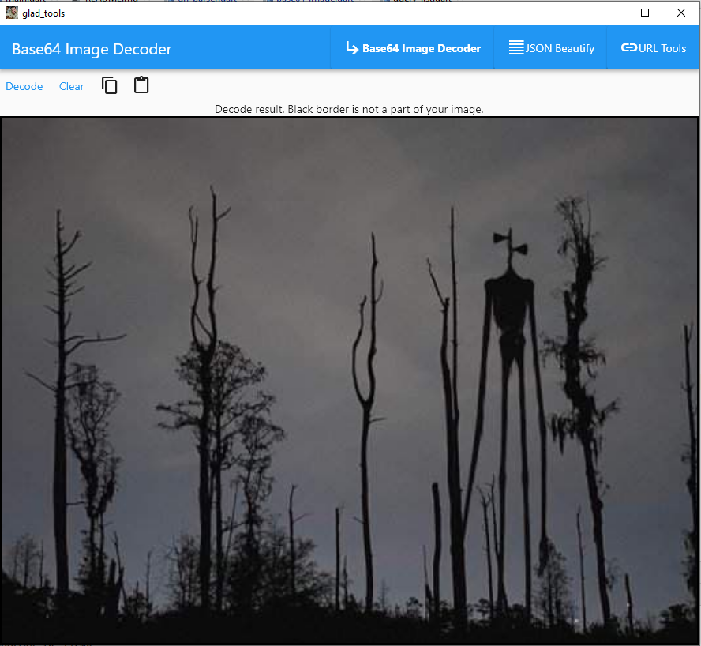
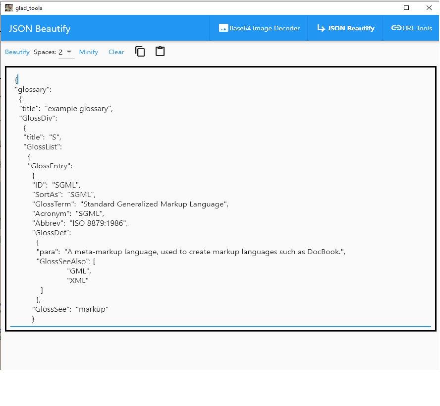
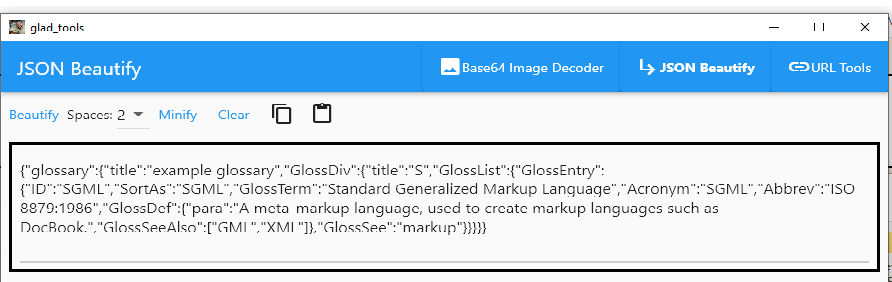
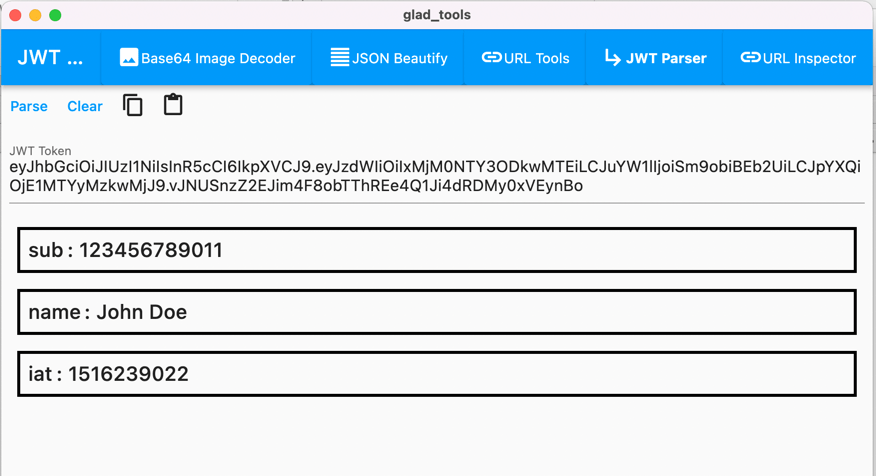
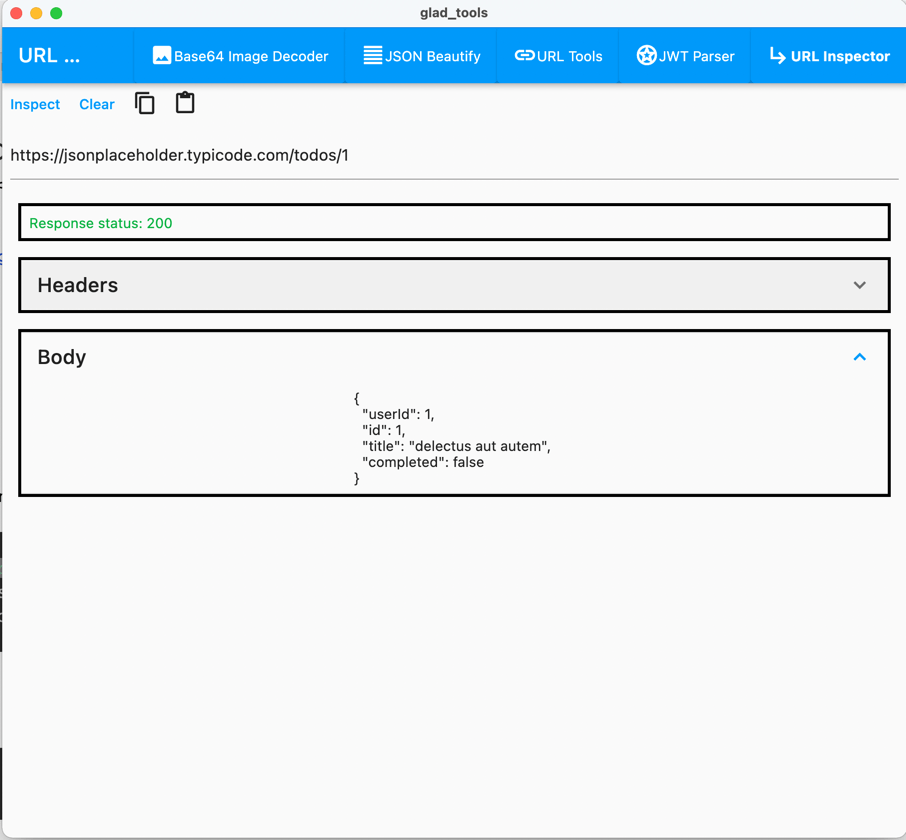

# glad_tools
 A set of tools for everyday tasks.

# Introduction

This is the toolbox that can be helpful for devs to make every day tasks such as:

- [x] JSON Beautify
- [x] JSON minify
- [x] Base64 to Image
- [?] Image to Base 64
- [x] Url elements visualiser
- [x] Url Encoder/Decoder (URL percent-based encoding)
- [x] JWT parser

Works on:

- [x] Windows
- [x] Linux
- [x] macOS

# Download

## All binaries are available on Release page:

[Releases](https://github.com/gladimdim/glad_tools/releases)

## Windows 10

 [Download VC++ Redistributable](https://support.microsoft.com/en-us/topic/the-latest-supported-visual-c-downloads-2647da03-1eea-4433-9aff-95f26a218cc0) package before launching. (I guess you already have it installed).

# Why

Everyday all of us have to convert images, parse URLs, minify JSONs. We all use some online tools found in Google Top-5 results.
But are you sure they don't leak sensitive data? Are you sure YOU don't leak some company data like tokens, internal URL, passwords, logins?
All this data can be used by online tools and you will never know about it.

# Installation

Clone this repo. Make sure you have Desktop support enabled in Flutter:

```
flutter config --enable-windows-desktop
flutter config --enable-linux-desktop
flutter config --enable-macos-desktop
```

Run the app:

```
flutter run -d Windows
flutter run -d Linux
flutter run -d macOS
```

# Examples

## Base64 Image



## URL Parser


## JSON Tools

### Beautify:


### Minify:


### JWT Token parser



### URL Inspector


